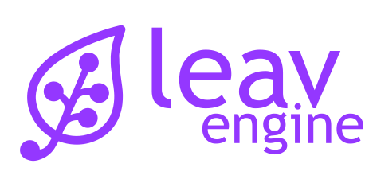

<div align="center">
    <a href="https://leav-engine.com">
        
    </a>
    <h2>Design powerful and scalable data models for your apps</h2>
    <p align="center">
        <a href="https://leav-engine.com"><b>Website</b></a> •
        <a href="https://docs.leav-engine.com"><b>Users Docs</b></a> •
        <a href="https://developers.leav-engine.com"><b>Developers Docs</b></a>
    </p>
    <p align="center">
        <a href="https://opensource.org/licenses/LGPL-3.0">
            
        </a>
    </p>
</div>

-------

# Get started
**We recommend to use our Docker images along with our docker-compose example file to start using LEAV-Engine.**

### Prerequisites

You'll need to have [Docker](https://docs.docker.com/get-docker/) with [Docker compose](https://docs.docker.com/compose/install/) installed on your machine.

### Install

1. Open a terminal, create a folder for leav-engine and get in it
```
mkdir ~/leav-engine && cd ~/leav-engine
```

2. Download the docker-compose file:
```
curl -O https://raw.githubusercontent.com/leav-solutions/leav-engine/master/docker/docker-compose.prod.yml
```

3. Start the services:
```
docker-compose -f docker-compose.prod.yml up -d
```

4. Once the install is done, you can access LEAV-Engine at http://core.leav.localhost. The initial start might take a while. During this time, you might encounter a `Bad gateway` error. Wait a few minutes and try to refresh the page. You can check the docker logs to see what's going on.

_We advise to use Chrome or Firefox as they will figure out that this is a local domain. Otherwise, you will have to add this domain to the `/etc/hosts` file:_
```
127.0.0.1 core.leav.localhost
```


Have fun! 🚀

-------

### Getting secure
Enabling HTTPS access is highly recommended when you'll run LEAV-Engine on a public domain.

Here are the few modifications on the base docker-compose file to do so:
- On the `core` service, add these labels:
```
- traefik.http.routers.core.rule=Host(`<your public domain>`)
- traefik.http.routers.core.entrypoints=web,websecure
- traefik.http.routers.core.tls.certresolver=letsencrypt
```
- On the `traefik` service, add these labels:
```
- "--entrypoints.websecure.address=:443"
- "--entrypoints.web.http.redirections.entrypoint.to=websecure"
- "--entrypoints.web.http.redirections.entrypoint.scheme=https"
- "--certificatesresolvers.letsencrypt.leav_engine.email=contact@leav-solutions.com"
- "--certificatesresolvers.letsencrypt.leav_engine.storage=/letsencrypt/leav_engine.json"
- "--certificatesresolvers.letsencrypt.leav_engine.tlschallenge=true"
```
- On the `traefik` service, open the port 443:
```
- "443:443"
```
- On the `traefik` service, add a volume to store the certificates:
```
- lets_encrypt_cert:/letsencrypt
```
- Add the certificates volume to the volumes section:
```
lets_encrypt_cert:
    driver: local
```
- Don't forget to use secure protocols in public URLs:
```
SERVER_PUBLIC_URL: https://<your public domain>
SERVER_WS_URL: wss://<your public domain>
```

### Getting quicker
In order to speed up the DB queries, it's possible to enable ArangoDB's query cache.
To do so:
- Create a `conf` folder right beside the `docker-compose.prod.yml` with a `arangodb` folder in it
- Copy our [arangod.conf](https://github.com/leav-solutions/leav-engine/blob/master/docker/conf/arangodb/arangod.conf) file in it.
- Mount this directory in the `arangodb` service, by adding this volume in the `docker-compose.prod.yml` file:
```
- ./conf/arangodb/arangod.conf:/etc/arangodb3/arangod.conf
```

Don't forget to re-launch your containers with a down / up.
More info about the cache on [ArangoDB docs](https://www.arangodb.com/docs/stable/aql/execution-and-performance-query-cache.html#global-configuration)

-------

## Running from the source
If you want to go deeper into LEAV-Engine or try out the latest features before the release, feel free to clone this repo.
Then, all you have to do is:
```
cd docker
docker-compose up -d
```
This will start LEAV-Engine in development mode.

⚠️ **Docker v.20.10** or higher is required to run the core.

# Contributing
We're glad you're interested in contributing to LEAV-Engine!
Giving us feedback or reporting bugs are already a great way to contribute to the project. Feel free to [open an issue](https://github.com/leav-solutions/leav-engine/issues) on this repo, we'll be happy to help you.

Want to contribute to the code, add new features or fix bugs? We'd love to have you on board! Feel free to open a PR, we'll review it as soon as possible.

# Technical details
This is the monorepo for all LEAV Engine services. It contains all projects related to LEAV Engine, including the core, the automate and the front apps.
All apps are located in the `src/apps` folder. All shared code must live in the `src/libs` folder.

We're using [Yarn Workspaces](https://yarnpkg.com/features/workspaces) to manage dependencies and scripts running across all projects.

## Dependencies

### Add dependencies
Each project have its own dependencies in its own `package.json`.
When adding dependencies, Yarn will handle the different packages on different versions required for each project. See [Yarn doc](https://yarnpkg.com/features/workspaces) for more details.
That said, even though Yarn is smart enough to make everything running smoothly, it is encouraged to use the same package version across all projects.

To require some internal dependency, simply add it with the `@leav` prefix.

#### Global dependencies
To add a package that will be available for all projects:

```yarn add <my_package>```


#### Per project dependency
To add a package available for only one project:

```yarn workspace <my_project_name> add <my_package_name>```

or, go to project folder and add package:

```cd apps/<project_name> && yarn add <my_package_name>```

### Installing dependencies
To install all deps for all projects, just run `yarn install` at the root of the repo.
To install deps for one project only, just go its folder and then run `yarn install`.

## Shared libs
If you want to create a shared lib available for all projects, create a new folder in the `libs` folder. The `name` declared in `package.json` must be prefixed with `@leav` so that Yarn will be aware of it.

IMPORTANT: a shared lib has to be built in order to be used by other project. So, when your lib is ready:
- Run `yarn build`
- **commit the `dist` folder**
- In `package.json` the `main` file must be in the `dist` folder.

Don't forget to enable definition files in `tsconfig.json` to offer a smooth Typescript experience to other devs using your lib ;)

To use it in a project, just add it with a `yarn add @leav/my_lib`.
Then, in your code, you can import it and use it like a regular package:
```
import {mySuperFunc} from '@leav/my_lib'

mySuperFunc();
```

---

## Accessing UIs

A few URLs are handled by the proxy (Traefik) to manage and access your app:

-   http://admin.leav.localhost: Admin app
-   http://arango.leav.localhost: Arango DB admin
-   http://core.leav.localhost/graphql: GraphQL playground
-   http://rabbitmq.leav.localhost: RabbitMQ admin
-   http://data-studio.leav.localhost/: Data Studio app

You might need to add it to your `/etc/hosts` file to access it:

```
127.0.0.1 admin.leav.localhost
127.0.0.1 core.leav.localhost
127.0.0.1 arango.leav.localhost
127.0.0.1 rabbitmq.leav.localhost
127.0.0.1 data-studio.leav.localhost
```

---

## Database

The database will be created automatically when initializing the server.

By default, it's called `leav_core` and can be managed at http://arango.leav.localhost/_db/leav_core/_admin/aardvark/index.html#collections

Default username is `root` with no password.

### ArangoDb Upgrade:
After an upgrade, ArangoDB might not start, saying it requires a db upgrade. Run this command to fix this:
```
docker-compose run arangodb arangod --database.auto-upgrade
```


---

## Accessing containers

You can get into containers with a shell:

```bash
docker-compose exec <service_name> /bin/sh
```

---

## Running tests

### Unit tests

Though you can run unit testing inside the container, it might not be very convenient and resource consuming.
You'd better run it locally, on your machine with a standard `npm run test`.

### E2E tests

End-to-end testing needs to be ran inside the container as it starts a server, access to the DB, etc.
This can be done by either:

-   Running a shell in the container and executing `npm run test:e2e`
-   Executing the command from your machine: `docker exec -i docker-compose_leav_core_1 npm run test:e2e`

---

## Services logs

All services logs out to stdout and stderr. Use `docker-compose logs` if you need to read it:

```bash
docker-compose logs -ft <service_name>
```

More infos: https://docs.docker.com/compose/reference/logs/

---

## Applications
### Adding new modules
When creating a new application, the core will be looking in the `apps/core/applications/modules` folder to check available modules.
Name, description and version will be retrieved from `package.json`.

If you want to add your own module, just drop your folder right there.

### Installation
On application creation, the core will check for a script called `app_install.sh` . It must be present at the root of your module.

This script will be executed first on creation and on demand afterwards. Make sure running the script multiple times will not cause any errors or damages.

**This script is responsible for doing everything it takes to have an instance ready to run (eg. building JS files)** and **copying required files in the instance folder**. When accessing the application, the core will serve the `index.html` file of this app folder.

A few environment variables are available in the script with all settings required to build the app:

- `LEAV_API_URL`: full URL of the GraphQL API (eg: https://your-domain.com/graphql)
- `LEAV_WS_URL`: full URL of the GraphQL WS API, used for subscriptions (eg: wss://your-domain.com/graphql)
- `LEAV_AUTH_URL`: full URL of the auth endpoint (eg: https://your-domain.com/auth/authenticate)
- `LEAV_DEFAULT_LANG`: default language, configured in core configuration
- `LEAV_AVAILABLE_LANG`: available languages, configured in core configuration
- `LEAV_LOGIN_ENDPOINT`: global login endpoint
- `LEAV_APP_ENDPOINT`: app endpoint
- `LEAV_APPLICATION_ID`: app ID
- `LEAV_DEST_FOLDER`: destination folder. All files needed to run the instance must land here.

### Un-installation
Before deleting an application, the core will check for a script called `app_uninstall.sh`.
It must be present at the root of your module.
This script is responsible for cleaning up everything it needs before the core deletes the instance folder.
**This script is optional**.

A few environment variables are available in the script:
- `LEAV_APPLICATION_ID`: Application ID
- `LEAV_DEST_FOLDER`: instance folder


# License
LEAV-Engine is released under the [LGPL v3](https://www.gnu.org/licenses/lgpl-3.0.txt) license.
