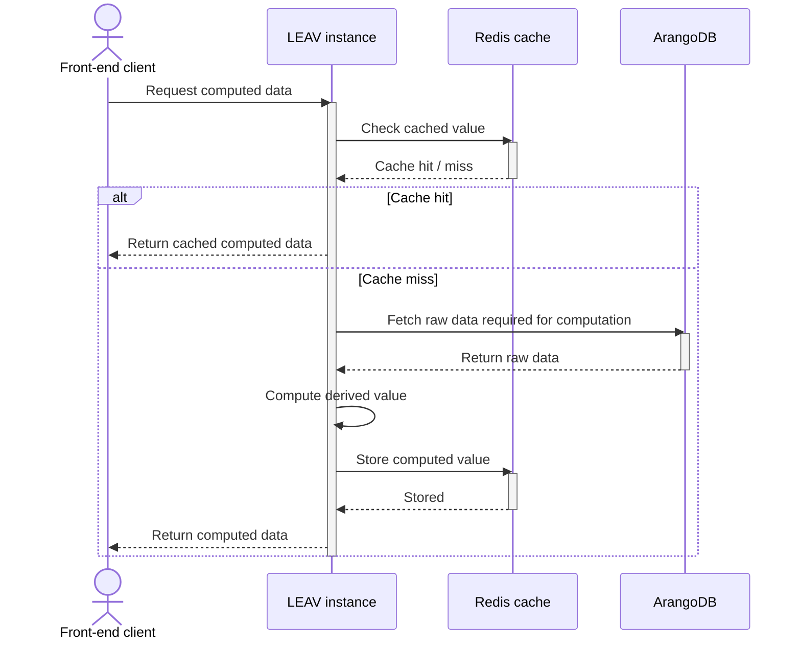
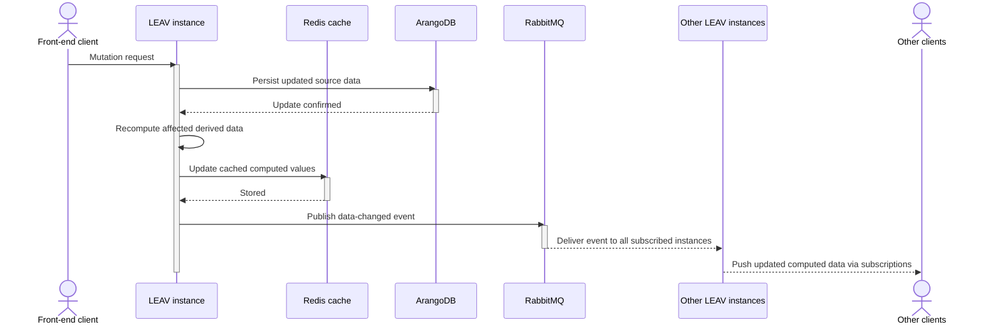

# Plugins real-time computed data architecture

**Date:** 2026-04-20

## Context

We need a plugin architecture that enables:

- A strong developer experience (DX) for building LEAV plugins.
- End-to-end type safety between front-end and back-end.
- Code sharing across front-end and back-end (e.g. shared schemas, types, and business logic).
- Support for real-time data updates across multiple clients and leav instances.

A key challenge is handling **computed data** derived from database state:

- It should be fast to read (low latency).
- It must stay consistent when underlying data changes.
- It must be propagated in real time to all interested clients across all instances.

## Decision

We adopt a **tRPC-based API layer** as the main interface for plugin capabilities.

- tRPC procedures are used for:
    - Queries (reading computed data)
    - Mutations (updating source data)
    - Subscriptions (real-time updates to clients)
- End-to-end type inference ensures strong type safety between front-end and back-end.
- Shared TypeScript code (schemas, validators, helpers) is used across the stack.

### Data Flow Components

- **ArangoDB**: The primary database, source of truth for raw data.
- **Redis**: Cache for computed data derived from the primary database.
- **RabbitMQ**: Event bus used to propagate changes across LEAV instances.
- **tRPC subscriptions**: Real-time channel to push updates to connected clients.

### Computed Data Strategy

- Computed data is:
    - Derived from database state
    - Cached in Redis for fast access
    - Invalidated and recomputed when underlying data changes

### Cross-Instance Synchronization

- All LEAV instances subscribe to RabbitMQ events.
- Upon receiving an event:
    - Each instance updates or invalidates its local view of computed data (if applicable).
    - Each instance pushes the update to its connected clients via tRPC subscriptions.

### Real-Time Propagation

- Clients subscribe to relevant data via tRPC subscriptions.
- When computed data changes:
    - Updates are pushed from each LEAV instance to its connected clients.
    - This ensures low-latency, real-time synchronization across all clients, regardless of which instance they are connected to.

### Read Flow

When a client requests computed data:

1. The client calls a tRPC query.
2. A LEAV instance:
    - Checks Redis for the computed value.
    - If present: returns the cached value immediately.
    - If absent:
        - Fetches required raw data from the database.
        - Computes the derived value.
        - Stores it in Redis.
        - Returns it to the client.

### Write Flow

When a client updates data:

1. The client calls a tRPC mutation.
2. A LEAV instance:
    - Persists the updated data in the primary database.
    - Recomputes and updates all affected computed data in Redis.
    - Publishes an event to RabbitMQ describing the change (including affected computed data or invalidation keys).

